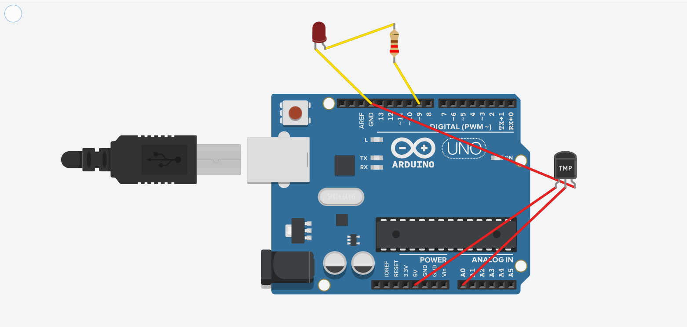

# Smart Temperature-Controlled Fan (Arduino Simulation)

This project simulates a temperature-controlled fan system using an Arduino Uno and a TMP36 temperature sensor. The fan (represented by an LED) turns on when the temperature exceeds 30.5°C.

## Components Used

- Arduino Uno R3
- TMP36 Temperature Sensor
- LED (as fan)
- 220Ω Resistor
- Breadboard
- Jumper Wires

##  Simulation

You can simulate this project using Tinkercad Circuits.

## How It Works

1. The TMP36 sensor outputs a voltage proportional to the ambient temperature.
2. The Arduino reads this voltage and calculates the temperature in Celsius.
3. If the temperature exceeds 30.5°C, the LED turns on, simulating a fan activation.

## Circuit Diagram

## 🚀 Future Improvements

- Integrate an LCD to display real-time temperature.
- Replace the LED with a DC motor for realistic fan simulation.
- Add IoT capabilities for remote monitoring and control.

## 📄 License

This project is licensed under the MIT License.
